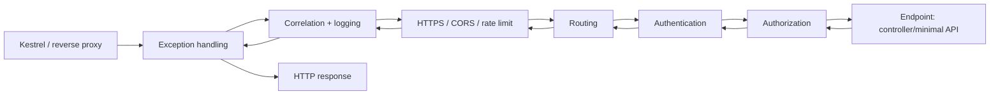
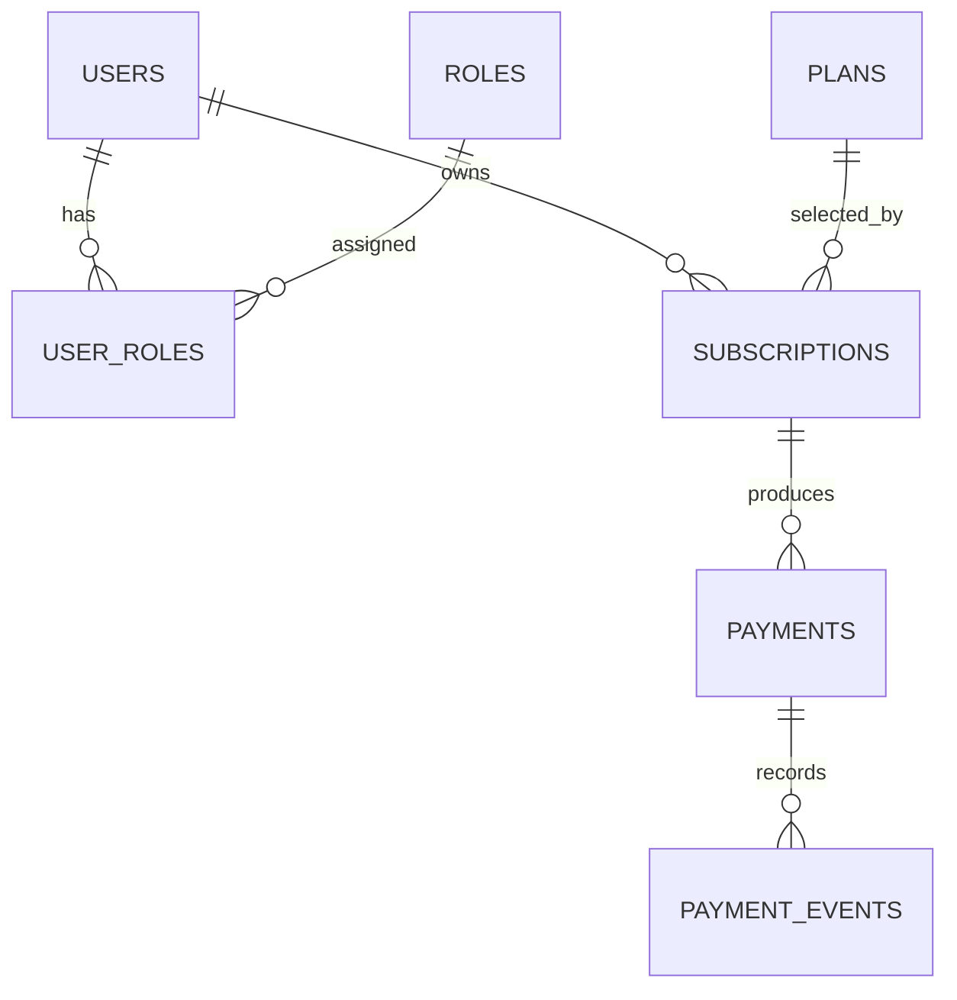

# ASP.NET Core Web API & EF Core Interview Answers

This guide is designed for a senior .NET interview. Each section gives a concise answer you can say aloud, the deeper explanation an interviewer may probe, and production-oriented code examples.

---

# Part 1: ASP.NET Core / Web API

## 1. HTTP request lifecycle in ASP.NET Core

### Interview answer

> Kestrel receives the HTTP request and ASP.NET Core creates an `HttpContext`. The request then travels through the middleware pipeline in registration order. Middleware can inspect or change the request, short-circuit it, or run code after the next component completes. Routing selects an endpoint; authentication establishes the user identity; authorization checks endpoint policies; model binding and validation create endpoint parameters; finally the controller/minimal API handler executes. The response travels back outward through the middleware pipeline, where logging, exception handling, headers, and response transforms can run.

### Request flow



Middleware executes like nested calls: code before `await next(context)` runs on the way in; code after it runs on the way out. Order matters. Exception handling must be early so it can catch downstream exceptions; authentication must happen before authorization.

```csharp
var builder = WebApplication.CreateBuilder(args);
builder.Services.AddControllers();
builder.Services.AddAuthentication().AddJwtBearer();
builder.Services.AddAuthorization();

var app = builder.Build();
app.UseExceptionHandler();              // catches downstream exceptions
app.UseHttpsRedirection();
app.UseRouting();
app.UseAuthentication();                // creates HttpContext.User
app.UseAuthorization();                 // evaluates endpoint requirements
app.MapControllers();
app.Run();
```

In a controller, model binding gets values from route/query/header/body; input formatters deserialize JSON; validation runs; then the action executes. In Minimal APIs, validation/binding behavior depends on the endpoint setup and types used, so make validation explicit when required.

## 2. Middleware and global exception handling

### Interview answer

> Middleware is a component in the request pipeline. It receives `HttpContext`, may call the next component, and may short-circuit the pipeline. For global exception handling, I use the built-in exception-handler middleware or a custom middleware early in the pipeline. It logs the exception with the request trace ID, maps known domain exceptions to stable RFC 7807 problem responses, and never exposes stack traces or internal details to clients in production.

### Built-in problem details approach

```csharp
builder.Services.AddProblemDetails();
builder.Services.AddExceptionHandler<GlobalExceptionHandler>();

var app = builder.Build();
app.UseExceptionHandler();
```

```csharp
public sealed class GlobalExceptionHandler(
    ILogger<GlobalExceptionHandler> logger,
    IProblemDetailsService problemDetails) : IExceptionHandler
{
    public async ValueTask<bool> TryHandleAsync(
        HttpContext context,
        Exception exception,
        CancellationToken cancellationToken)
    {
        logger.LogError(exception, "Unhandled exception for {Method} {Path}; TraceId={TraceId}",
            context.Request.Method, context.Request.Path, context.TraceIdentifier);

        var (status, title) = exception switch
        {
            NotFoundException => (StatusCodes.Status404NotFound, "Resource not found"),
            DomainValidationException => (StatusCodes.Status422UnprocessableEntity, "Business rule violated"),
            ConcurrencyException => (StatusCodes.Status409Conflict, "The resource was changed"),
            _ => (StatusCodes.Status500InternalServerError, "An unexpected error occurred")
        };

        context.Response.StatusCode = status;
        return await problemDetails.TryWriteAsync(new ProblemDetailsContext
        {
            HttpContext = context,
            Exception = exception,
            ProblemDetails = new ProblemDetails
            {
                Status = status,
                Title = title,
                // Do not leak exception.Message if it may contain implementation/secrets.
                Extensions = { ["traceId"] = context.TraceIdentifier }
            }
        });
    }
}
```

Do not use exception handling for normal validation flow. Return 400/422 deliberately for invalid input; reserve exceptions for exceptional situations. Avoid a catch-all handler that turns every error into `200 OK` or loses the original error/stack trace in logs.

## 3. Authentication versus authorization

| Concept | Question answered | Example |
| --- | --- | --- |
| Authentication | “Who are you?” | Validate an access token and construct a `ClaimsPrincipal`. |
| Authorization | “Are you allowed to do this?” | Permit a user to refund only their own order, or an admin to refund any order. |

Authentication happens first. It establishes the identity. Authorization then evaluates roles, claims, scopes, policies, resource ownership, and other rules.

```csharp
[Authorize(Policy = "payments.refund")]
[HttpPost("orders/{orderId:guid}/refund")]
public async Task<IResult> Refund(Guid orderId, ClaimsPrincipal user) { /* ... */ }
```

For resource authorization, checking a role alone is often insufficient. Load the resource and verify the caller owns it or has a suitable elevated permission.

## 4. Secure JWT authentication

### Interview answer

> JWTs are signed bearer credentials, not encrypted session storage. I use an OAuth 2.0/OpenID Connect identity provider to issue short-lived access tokens. The API validates issuer, audience, signature, lifetime, and signing keys obtained through secure metadata/key rotation. I enforce HTTPS, use authorization policies/scopes rather than trusting arbitrary claims, keep tokens out of URLs and logs, and protect refresh tokens with stronger storage and rotation controls. For high-risk actions I can require recent authentication or token revocation checks.

### Configuration example

Prefer an external identity provider and asymmetric signing keys. Do not hand-roll login or issue tokens using a hard-coded symmetric secret in source code.

```csharp
builder.Services.AddAuthentication("Bearer")
    .AddJwtBearer("Bearer", options =>
    {
        options.Authority = builder.Configuration["Auth:Authority"]!;
        options.Audience = "orders-api";
        options.RequireHttpsMetadata = true;
        options.TokenValidationParameters.ValidateIssuer = true;
        options.TokenValidationParameters.ValidateAudience = true;
        options.TokenValidationParameters.ValidateLifetime = true;
        options.TokenValidationParameters.ClockSkew = TimeSpan.FromMinutes(1);
        // Signing keys are normally retrieved via the issuer's JWKS metadata.
    });

builder.Services.AddAuthorization(options =>
{
    options.AddPolicy("payments.refund", policy =>
    {
        policy.RequireAuthenticatedUser();
        policy.RequireClaim("scope", "payments.refund");
    });
});
```

Security details worth mentioning:

- Use short-lived access tokens; validate `iss`, `aud`, `exp`, `nbf`, and signature algorithm/key.
- Reject weak/incorrect algorithms; do not accept a token merely because it parses.
- Use HTTPS end-to-end, secure headers, secret vaults, and key rotation.
- Never put access tokens in query strings; redact `Authorization` headers from logs.
- For browser apps, understand the XSS/CSRF trade-off. HttpOnly/Secure/SameSite cookies reduce token theft by JavaScript but require CSRF protection; an in-memory token avoids persistent browser storage but needs refresh flow design.
- Use service identities/client credentials for service-to-service calls instead of sharing user tokens or static API keys.

## 5. Versioning a public REST API

### Interview answer

> I prefer compatible, additive changes: new optional fields and endpoints do not need a new API version. For genuine breaking changes—removed/renamed fields or changed semantics—I publish an explicit version, maintain the prior version through a communicated deprecation period, measure client usage, and remove it only after migration. I choose one versioning convention and document it consistently.

Common conventions are URL path (`/v1/orders`), media type/version headers, or a query string. Path versioning is easy for external clients and gateway routing; headers keep URLs clean but are less visible. The important choice is compatibility, a clear lifecycle, and usage measurement.

```csharp
[ApiController]
[Route("v{version:apiVersion}/orders")]
[ApiVersion("1.0")]
public sealed class OrdersV1Controller : ControllerBase
{
    [HttpGet("{id:guid}")]
    public ActionResult<OrderV1Response> Get(Guid id) => Ok();
}

[ApiController]
[Route("v{version:apiVersion}/orders")]
[ApiVersion("2.0")]
public sealed class OrdersV2Controller : ControllerBase
{
    [HttpGet("{id:guid}")]
    public ActionResult<OrderV2Response> Get(Guid id) => Ok();
}
```

The attributes show the intent; exact versioning package registration is an application dependency choice. Document a sunset date, migration guide, rate limits, error contract, pagination behavior, and schema through OpenAPI.

Never reuse a field name with a changed meaning. For events, consumers should ignore unknown fields and new fields should be optional/defaultable whenever possible.

## 6. Prevent overposting and validate request models

**Overposting** occurs when a client submits fields the server did not intend to let it control—for example `IsAdmin`, `UserId`, `OrderStatus`, or `Price`—and the server binds directly to a persistence entity.

### Safe pattern: request DTOs, server-side values, allow-lists

```csharp
public sealed class CreateOrderRequest
{
    [Required, MinLength(1)]
    public List<CreateOrderItemRequest> Items { get; init; } = [];
}

public sealed class CreateOrderItemRequest
{
    [Required, StringLength(64)]
    public string Sku { get; init; } = "";

    [Range(1, 100)]
    public int Quantity { get; init; }
}

[ApiController]
[Route("v1/orders")]
public sealed class OrdersController : ControllerBase
{
    [HttpPost]
    [Authorize]
    public async Task<ActionResult> Create(CreateOrderRequest request, CancellationToken ct)
    {
        // Customer identity comes from the token; price comes from trusted catalog data.
        var customerId = User.FindFirstValue("sub")!;
        // Validate SKU availability, quantity rules, pricing, and business invariants.
        return Accepted();
    }
}
```

`[ApiController]` automatically returns a validation problem response for invalid Data Annotation model state. For complex cross-field/domain validation—such as “SKU exists, quantity does not exceed limit, and shipping country is allowed”—use a validator/service and return a stable error result. Validate again at the domain/database boundary; HTTP validation alone does not protect messages, internal jobs, or future endpoints.

Do not expose EF entities as public request/response contracts. DTOs prevent accidental fields from being writable and allow API contracts to evolve independently from tables.

## 7. Idempotent endpoints and why payment/order APIs need them

### Interview answer

> An idempotent operation can be safely repeated with the same intended request without creating a different business outcome. Network clients retry after timeouts, but a timeout does not mean the server failed—it may have successfully created an order before its response was lost. For POST operations with financial or order effects, I require an idempotency key, store the key plus request hash and final result durably with a unique constraint, and return the original response for repeats. For payment, I also pass a stable idempotency key to the external provider.

HTTP `GET`, `PUT`, and `DELETE` are conventionally idempotent in semantics; `POST` is generally not. But REST labels do not implement safety—you need durable application logic.

```sql
create table idempotency_records (
    customer_id uuid not null,
    key varchar(128) not null,
    request_hash char(64) not null,
    response_status int null,
    response_body jsonb null,
    created_at timestamptz not null default now(),
    primary key(customer_id, key)
);
```

```csharp
// Simplified core: production code should also handle an in-progress request lease.
var record = await db.IdempotencyRecords.FindAsync([customerId, key], ct);
if (record is not null)
{
    if (record.RequestHash != hash)
        return Results.Conflict(new { error = "Idempotency key was used with a different request." });
    return Results.Json(record.ResponseBody, statusCode: record.ResponseStatus);
}

// In one transaction: save order, outbox event, and completed idempotency response.
```

The database unique key is required to resolve concurrent retries. Redis can optimize a fast path but must not be the final correctness mechanism.

## 8. Resilience: retries, timeouts, and downstream failures

### Interview answer

> Every remote call has a timeout, cancellation propagation, and an explicit failure policy. I retry only transient, idempotent operations with exponential backoff and jitter; use circuit breaking to avoid amplifying an outage; limit concurrency to protect downstream systems; and move noncritical/slow operations to durable asynchronous processing. I distinguish a failure before a provider receives a request from an uncertain outcome after a timeout—payment-like calls need an idempotency key and reconciliation, not blind retries.

### HttpClient setup

Use `IHttpClientFactory`; it manages handler lifetimes and avoids ad-hoc `HttpClient` creation per request.

```csharp
builder.Services.AddHttpClient<IInventoryClient, InventoryClient>(client =>
{
    client.BaseAddress = new Uri("https://inventory.internal/");
    client.Timeout = TimeSpan.FromSeconds(3);
});
```

For retry/circuit-breaker configuration, use the resilience pipeline provided by your chosen .NET/platform stack. The policy principles are more important than a one-size-fits-all number:

- Bound each request with a deadline; propagate `CancellationToken`.
- Retry transient errors (connection failure, `408`, `429`, selected `5xx`) only when the operation is idempotent or protected by an idempotency key.
- Use exponential backoff with jitter; honor `Retry-After`.
- Circuit-break a failing provider temporarily; use a meaningful fallback only if it preserves business correctness.
- Apply bulkheads/concurrency limits to stop a slow dependency exhausting all threads/connections.
- Use a queue/outbox for work that need not complete in the request path.

Do not retry on every `400` or domain error, and do not retry a non-idempotent payment call with a new identifier after a timeout.

## 9. Structured logging, tracing, and correlation IDs

### Interview answer

> I use structured logs rather than interpolated text, OpenTelemetry traces for cross-service request paths, and metrics for rate/latency/errors/saturation. A W3C trace context is propagated in HTTP and message headers. I add a correlation ID for business/support workflows where useful, return it to the caller, and put it into every log scope. I do not log secrets, authorization headers, full payment data, or unreviewed PII.

```csharp
public sealed class CorrelationIdMiddleware(RequestDelegate next)
{
    public async Task Invoke(HttpContext context, ILogger<CorrelationIdMiddleware> logger)
    {
        const string header = "X-Correlation-ID";
        var correlationId = context.Request.Headers[header].FirstOrDefault();
        if (string.IsNullOrWhiteSpace(correlationId) || correlationId.Length > 128)
            correlationId = Guid.NewGuid().ToString("N");

        context.Response.Headers[header] = correlationId;
        using (logger.BeginScope(new Dictionary<string, object>
        {
            ["CorrelationId"] = correlationId,
            ["TraceId"] = System.Diagnostics.Activity.Current?.TraceId.ToString() ?? context.TraceIdentifier
        }))
        {
            await next(context);
        }
    }
}
```

```csharp
builder.Services.AddOpenTelemetry()
    .WithTracing(tracing => tracing
        .AddAspNetCoreInstrumentation()
        .AddHttpClientInstrumentation()
        .AddEntityFrameworkCoreInstrumentation()
        .AddOtlpExporter())
    .WithMetrics(metrics => metrics
        .AddAspNetCoreInstrumentation()
        .AddRuntimeInstrumentation()
        .AddOtlpExporter());

app.UseMiddleware<CorrelationIdMiddleware>();
```

`CorrelationId` groups a business journey; `TraceId` captures a technically causal request tree. They may be the same in simple systems, but do not assume that always holds. For messages, explicitly copy trace headers and establish a consumer span so an order request can be followed through workers.

---

# Part 2: Database & Entity Framework Core

## 10. Tracking versus no-tracking EF Core queries

### Interview answer

> A tracking query places returned entities in EF Core’s change tracker. EF records original values and identity-maps entities, allowing `SaveChanges` to detect and persist updates. It is appropriate when I intend to edit the entity. `AsNoTracking` skips that work, reducing memory and CPU for read-only queries. For read APIs I usually use no-tracking plus projection to a DTO; for update workflows I load a small tracked aggregate and save it with an optimistic concurrency token.

```csharp
// Read-only endpoint: no entity tracking, and only fetch columns the client needs.
var results = await db.Orders.AsNoTracking()
    .Where(o => o.CustomerId == customerId)
    .OrderByDescending(o => o.CreatedAt)
    .Select(o => new OrderSummaryDto(o.Id, o.Status, o.TotalAmount, o.CreatedAt))
    .ToListAsync(ct);

// Update workflow: tracked entity so change detection persists its modified properties.
var order = await db.Orders.SingleAsync(o => o.Id == id, ct);
order.Cancel(reason);
await db.SaveChangesAsync(ct);
```

`AsNoTrackingWithIdentityResolution` can be useful for read-only object graphs where repeated rows should refer to the same in-memory entity instance, but it has more overhead than plain no tracking.

## 11. The N+1 query problem

N+1 happens when code executes one query for a list of N parents, then one additional query per parent for related data. It creates excessive round trips and often collapses under latency/load.

```csharp
// Bad if lazy loading is enabled: 1 query for orders + N queries for Items.
var orders = await db.Orders.ToListAsync(ct);
foreach (var order in orders)
    total += order.Items.Sum(i => i.Quantity * i.UnitPrice);
```

### How to identify it

- Enable EF Core command logging in development/test.
- Inspect distributed traces/database query telemetry for repeated similar SQL.
- Use query-count assertions in integration tests for critical endpoints.
- Watch database latency, connection pool activity, and request query counts.

### Fixes

```csharp
// Best for most API reads: projection; SQL computes/returns exactly required shape.
var summaries = await db.Orders.AsNoTracking()
    .Where(o => o.CustomerId == customerId)
    .Select(o => new OrderSummaryDto(
        o.Id,
        o.Status,
        o.Items.Sum(i => i.Quantity * i.UnitPrice),
        o.Items.Count))
    .ToListAsync(ct);

// When a full object graph is genuinely needed:
var orders = await db.Orders
    .Include(o => o.Items)
    .AsSplitQuery() // consider when several collection Includes would create a cartesian explosion
    .ToListAsync(ct);
```

Avoid enabling lazy loading by default in web APIs; it makes database access invisible and can serialize unexpected navigation properties after the intended query scope.

## 12. Include vs Select vs explicit loading vs lazy loading

| Technique | Best use | Main risk |
| --- | --- | --- |
| `Select` projection | API/read model; fetch only needed fields, calculate in SQL | More mapping code, but usually worth it. |
| `Include` | Small, known object graph needed for a domain operation | Multiple collections can multiply rows/cartesian explode. |
| Explicit loading | Conditional, intentional loading of one navigation | Can become N+1 inside loops. |
| Lazy loading | Rarely, controlled desktop/domain scenarios | Hidden queries, N+1, surprising serialization. |

```csharp
// Explicit loading: intentional one-off; do not place this in a loop over orders.
var order = await db.Orders.SingleAsync(x => x.Id == id, ct);
await db.Entry(order).Collection(x => x.Items).LoadAsync(ct);
```

For wide graphs, assess generated SQL. `AsSplitQuery()` turns a large joined result into several queries and can avoid cartesian explosion; `AsSingleQuery()` can reduce round trips. Choose based on result size, latency, and consistency needs rather than applying either everywhere.

## 13. Index design for an Orders table

### Start with query patterns

Indexes serve queries, not columns. Ask: do we commonly fetch one order by ID, list a customer’s newest orders, find pending orders for workers, or filter by date/status? Then inspect real execution plans.

```sql
-- Primary key already supports point lookup by order ID.
-- Common customer history query:
-- WHERE customer_id = @customerId ORDER BY created_at DESC LIMIT @pageSize
create index ix_orders_customer_created
    on orders(customer_id, created_at desc);

-- Worker query for pending work. Partial/filtered index avoids indexing completed rows.
create index ix_orders_pending_created
    on orders(created_at)
    where status = 'Pending';

-- If support searches external payment IDs:
create unique index ux_orders_external_reference
    on orders(external_reference)
    where external_reference is not null;
```

Composite index order matters: equality filters generally come first, then range/order columns. Include/covering columns can avoid table lookups for a hot read, but every index makes inserts/updates slower and uses storage. Index foreign keys used in joins and deletion checks. Avoid indexing every column or low-selectivity columns (`status`) alone unless a filtered/compound index matches a real query.

Use keyset/cursor pagination for large, frequently accessed histories rather than high-offset pagination:

```sql
select id, status, total_amount, created_at
from orders
where customer_id = @customerId
  and (created_at, id) < (@cursorCreatedAt, @cursorId)
order by created_at desc, id desc
limit 50;
```

## 14. Transactions and isolation levels

### Interview answer

> A transaction provides atomicity: either all of its changes commit or none do. Isolation determines what concurrent transactions may observe. I keep transactions short, choose the lowest isolation level that preserves the invariant, enforce critical rules with database constraints, and use optimistic concurrency for ordinary update conflicts. For complex concurrent workflows, I inspect the database’s actual isolation semantics and execution behavior rather than assuming all databases behave the same.

Common phenomena: dirty reads (seeing uncommitted data), non-repeatable reads (a row changes between two reads), and phantom reads (a query returns additional rows later). Exact behavior is database-specific.

| Level | Typical trade-off |
| --- | --- |
| Read committed | Common default; avoids dirty reads, but a repeated read may differ. |
| Repeatable read | Stabilizes rows read in a transaction; may use stronger locks/versioning. |
| Serializable | Strongest illusion of serial execution; can cause blocking/serialization failures and requires retry. |
| Snapshot/MVCC variants | Readers see a consistent version; write conflicts still need handling. |

```csharp
await using var transaction = await db.Database.BeginTransactionAsync(
    System.Data.IsolationLevel.Serializable, ct);
try
{
    // Read inventory and reserve it only if available.
    // Use conditional update / constraints where possible.
    await db.SaveChangesAsync(ct);
    await transaction.CommitAsync(ct);
}
catch
{
    await transaction.RollbackAsync(ct);
    throw;
}
```

`SaveChanges` is transactional for the commands it issues in most relational providers. Use an explicit transaction only when one logical unit needs multiple saves/commands. Do not hold transactions open while calling a remote payment API: that harms locks/connection capacity and still cannot make the remote system atomic.

## 15. Preventing duplicate order creation on client retry

Use a layered design:

1. Require an `Idempotency-Key` on create operations.
2. Store `(customer_id, idempotency_key)` under a unique database constraint.
3. Store a request hash; reject reuse of the key with a different body.
4. Store/replay the original outcome, including a pending state if processing is asynchronous.
5. Create the order, idempotency record, and outbox event in the same database transaction.

```csharp
modelBuilder.Entity<IdempotencyRecord>()
    .HasKey(x => new { x.CustomerId, x.Key });

modelBuilder.Entity<Order>()
    .HasIndex(x => new { x.CustomerId, x.IdempotencyKey })
    .IsUnique();
```

The unique constraint handles a race where two identical requests arrive at nearly the same time on different API nodes. Catch the duplicate-key exception, read the existing record, and return it. For payments, also supply the provider idempotency key: database uniqueness alone cannot know whether a remote charge executed before a timeout.

## 16. When raw SQL or Dapper is preferable to EF Core

EF Core is strong for conventional CRUD, change tracking, migrations, LINQ composability, and domain transactions. It is not a rule that every query must use it.

Use raw SQL/Dapper when:

- A proven hot query needs a hand-tuned query plan, database-specific feature, window function, CTE, bulk operation, or stored procedure.
- You are building a read-heavy/reporting projection where mapping flat rows is simpler and faster.
- You need efficient batch operations not naturally represented by tracked entities.
- You are integrating with an existing SQL-first database/stored-procedure boundary.

Keep parameters parameterized—never concatenate user input into SQL—and put SQL behind a repository/query service with tests and observability.

```csharp
const string sql = """
    select id, status, total_amount as TotalAmount, created_at as CreatedAt
    from orders
    where customer_id = @CustomerId
    order by created_at desc
    limit @Limit;
    """;

var rows = await connection.QueryAsync<OrderSummaryDto>(sql,
    new { CustomerId = customerId, Limit = 50 });
```

Do not prematurely replace EF Core merely because a benchmark is marginally faster. First measure query count, generated SQL, indexes, allocations, and database plans. EF Core projection plus `AsNoTracking` is often sufficient.

## 17. Schema: users, roles, subscriptions, and payments

### Design principles

- A user may have many roles; a role belongs to many users: use a join table.
- A subscription is a time-based contract with a plan, status, current period, and provider reference.
- A payment is an immutable financial attempt/record linked to a subscription or order. Do not overwrite financial history.
- Store provider tokens/IDs, not raw card data. Use numeric decimal types for money, plus ISO currency code.
- Add audit/event tables where compliance or diagnosis requires history.



```sql
create table users (
    id uuid primary key,
    email varchar(320) not null,
    display_name varchar(200) not null,
    status varchar(32) not null,
    created_at timestamptz not null default now()
);
create unique index ux_users_email_normalized on users(lower(email));

create table roles (
    id uuid primary key,
    name varchar(100) not null unique
);
create table user_roles (
    user_id uuid not null references users(id),
    role_id uuid not null references roles(id),
    assigned_at timestamptz not null default now(),
    primary key(user_id, role_id)
);

create table plans (
    id uuid primary key,
    code varchar(64) not null unique,
    amount numeric(18,2) not null,
    currency char(3) not null,
    interval varchar(16) not null,
    active boolean not null default true
);

create table subscriptions (
    id uuid primary key,
    user_id uuid not null references users(id),
    plan_id uuid not null references plans(id),
    status varchar(32) not null,
    provider_subscription_id varchar(128) unique,
    current_period_start timestamptz not null,
    current_period_end timestamptz not null,
    cancel_at_period_end boolean not null default false,
    version bigint not null default 0,
    created_at timestamptz not null default now()
);
create index ix_subscriptions_user_status on subscriptions(user_id, status);

create table payments (
    id uuid primary key,
    subscription_id uuid null references subscriptions(id),
    order_id uuid null,
    provider_payment_id varchar(128) unique,
    idempotency_key varchar(128) not null unique,
    amount numeric(18,2) not null,
    currency char(3) not null,
    status varchar(32) not null,
    failure_code varchar(100) null,
    created_at timestamptz not null default now(),
    updated_at timestamptz not null
);
create index ix_payments_subscription_created on payments(subscription_id, created_at desc);

create table payment_events (
    id uuid primary key,
    payment_id uuid not null references payments(id),
    type varchar(64) not null,
    provider_event_id varchar(128) unique,
    payload jsonb not null,
    occurred_at timestamptz not null
);
```

### Important production details

- Add a check constraint or application invariant for exactly one payment owner if a payment must belong to either an order or a subscription.
- Treat payment-provider webhooks as untrusted input until their signature is verified. Save `provider_event_id` with a unique constraint so repeated delivery is safe.
- Use optimistic concurrency (`rowversion` in SQL Server or a version/xmin strategy in PostgreSQL) to avoid lost updates, particularly when webhook and user actions can modify a subscription concurrently.
- Support plan price history. Do not alter historical payment amount when a plan’s current price changes.
- Consider soft deletion and PII anonymization based on legal retention rules; retain financial audit records as required.

---

# Final interview checklist

For API questions, mention input boundaries, authorization, idempotency, timeouts, and observability—not only controllers and JSON.

For EF Core questions, mention generated SQL, query counts, indexes, constraints, transaction duration, and concurrency—not only LINQ syntax.

The strongest answers are specific about an invariant—“do not charge twice,” “only the order owner can view it,” “a retry must return the original result”—and use the database plus application design to enforce it.
