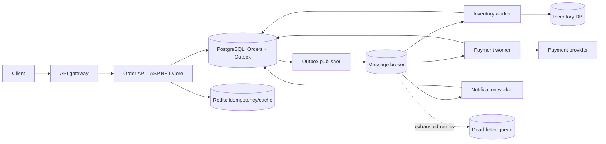
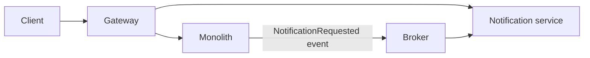

# Senior .NET System Design & Architecture Interview Guide

This guide models the level of answer expected in a senior or staff-level interview at a high-scale technology company. The examples use ASP.NET Core, PostgreSQL, Redis, and a message broker, but the principles apply equally to Azure Service Bus, RabbitMQ, Kafka, or AWS SQS/SNS.

---

## 1. System-design prompt: high-volume order processing

**Prompt:** Design an order-processing platform that accepts customer orders, charges payment, reserves inventory, and notifies customers. It must process **10 million events/day**.

### 1.1 Start by clarifying requirements

A strong interview answer starts with questions, not architecture diagrams.

| Area | Questions / assumptions |
| --- | --- |
| Functional | Create order, retrieve status, charge once, reserve/release inventory, notify the customer. |
| Traffic | 10M events/day is about 116 events/sec on average; design for 10–20x peaks: 1,000–2,000 events/sec. |
| Latency | Order acceptance p99 under 300 ms; downstream fulfilment can be asynchronous. |
| Consistency | The customer must never be charged twice. Inventory must not oversell. Order status can be eventually consistent. |
| Availability | Order acceptance stays available during a notification or analytics outage. |
| Security | TLS, authenticated callers, authorization, PCI scope isolation, secrets in a vault, PII minimization. |

### 1.2 High-level design



The synchronous API does only the work required to **durably accept** the order. It writes the order and an outbox event in one database transaction, returns `202 Accepted`, and workers perform slower or failure-prone work asynchronously.

### 1.3 APIs and data model

```http
POST /v1/orders
Idempotency-Key: 9fd6...
Content-Type: application/json

{
  "customerId": "cust_123",
  "items": [{ "sku": "book-42", "quantity": 2 }],
  "paymentMethodId": "pm_abc"
}

202 Accepted
{ "orderId": "ord_456", "status": "Pending" }
```

```sql
create table orders (
  id uuid primary key,
  customer_id uuid not null,
  status varchar(32) not null,
  total_amount numeric(18,2) not null,
  idempotency_key varchar(128) not null unique,
  created_at timestamptz not null default now(),
  version bigint not null default 0
);

create table outbox_messages (
  id uuid primary key,
  type varchar(200) not null,
  payload jsonb not null,
  occurred_at timestamptz not null,
  published_at timestamptz null,
  attempts int not null default 0
);

create index ix_outbox_unpublished on outbox_messages (occurred_at)
  where published_at is null;
```

Use SQL for the transactional order ledger, unique idempotency keys, and relational queries. Use a NoSQL/event store only if access patterns and scale justify it; it should not weaken the payment correctness guarantees. Redis is for cache and short-lived coordination, not the source of truth for money or orders.

### 1.4 .NET: durable order acceptance and the transactional outbox

```csharp
public sealed record CreateOrderRequest(
    Guid CustomerId, IReadOnlyList<OrderItemRequest> Items, string PaymentMethodId);
public sealed record OrderItemRequest(string Sku, int Quantity);

app.MapPost("/v1/orders", async (
    CreateOrderRequest request,
    [FromHeader(Name = "Idempotency-Key")] string key,
    OrdersDbContext db,
    CancellationToken ct) =>
{
    if (string.IsNullOrWhiteSpace(key))
        return Results.BadRequest(new { error = "Idempotency-Key is required" });

    // The database unique constraint is the final concurrency guarantee.
    var existing = await db.Orders.SingleOrDefaultAsync(x => x.IdempotencyKey == key, ct);
    if (existing is not null)
        return Results.Accepted($"/v1/orders/{existing.Id}", new { orderId = existing.Id, existing.Status });

    var order = Order.Create(request.CustomerId, request.Items, request.PaymentMethodId, key);
    db.Orders.Add(order);
    db.OutboxMessages.Add(OutboxMessage.From(new OrderSubmitted(order.Id)));

    try
    {
        await db.SaveChangesAsync(ct); // Order and event commit atomically.
    }
    catch (DbUpdateException ex) when (IsUniqueKeyViolation(ex))
    {
        var duplicate = await db.Orders.SingleAsync(x => x.IdempotencyKey == key, ct);
        return Results.Accepted($"/v1/orders/{duplicate.Id}", new { orderId = duplicate.Id, duplicate.Status });
    }

    return Results.Accepted($"/v1/orders/{order.Id}", new { orderId = order.Id, order.Status });
});
```

Never write an order and then publish directly to a broker as two unrelated operations: a crash between them loses the event. The outbox closes that gap. A hosted service repeatedly claims unpublished rows, sends them, and marks them published. Consumers must still be idempotent because a publisher can crash after sending but before marking a row published.

```csharp
public sealed class OutboxPublisher(OrdersDbContext db, IMessageBus bus) : BackgroundService
{
    protected override async Task ExecuteAsync(CancellationToken stoppingToken)
    {
        while (!stoppingToken.IsCancellationRequested)
        {
            var messages = await db.OutboxMessages
                .Where(x => x.PublishedAt == null)
                .OrderBy(x => x.OccurredAt).Take(100).ToListAsync(stoppingToken);

            foreach (var message in messages)
            {
                await bus.PublishAsync(message.Type, message.Id.ToString(), message.Payload, stoppingToken);
                message.PublishedAt = DateTimeOffset.UtcNow;
            }
            await db.SaveChangesAsync(stoppingToken);
            await Task.Delay(messages.Count == 0 ? TimeSpan.FromSeconds(1) : TimeSpan.Zero, stoppingToken);
        }
    }
}
```

In a real deployment, use row leasing (`FOR UPDATE SKIP LOCKED` or an equivalent) so multiple publisher instances do not claim the same work. The broker message ID should be the outbox message ID.

### 1.5 How to process 10 million events/day

1. Partition topics/queues by a stable key such as `orderId` so all events for an order remain ordered.
2. Run stateless consumers horizontally; each consumer uses bounded concurrency rather than unlimited `Task.WhenAll`.
3. Batch database reads/writes where safe, but keep transaction duration short.
4. Autoscale from queue depth, oldest-message age, CPU, and external-provider rate limits—not CPU alone.
5. Load-test peak throughput, poison messages, provider slowness, and recovery after a restart.

For 2,000 events/sec, one consumer group might have 32 partitions and 2–8 worker pods, tuned after measurement. The precise count is not guessed in an interview; explain the measurements that determine it.

### 1.6 Retries, DLQs, duplicate delivery, and payment safety

Message systems generally offer **at-least-once**, not exactly-once, delivery. Aim for *effectively once* business results through idempotency.

```csharp
public sealed class ChargePaymentHandler(PaymentsDbContext db, IPaymentProvider provider)
{
    public async Task Handle(OrderSubmitted message, CancellationToken ct)
    {
        // Persisted unique key: OrderId. A repeat message returns the prior result.
        var payment = await db.Payments.SingleOrDefaultAsync(p => p.OrderId == message.OrderId, ct);
        if (payment?.Status == PaymentStatus.Succeeded) return;

        payment ??= Payment.Pending(message.OrderId);
        if (db.Entry(payment).State == EntityState.Detached) db.Payments.Add(payment);
        await db.SaveChangesAsync(ct);

        // The provider also receives a stable idempotency key.
        var result = await provider.ChargeAsync(
            payment.Amount, idempotencyKey: $"charge:{message.OrderId}", ct);

        payment.Apply(result);
        await db.SaveChangesAsync(ct);
    }
}
```

Retry only transient failures (timeouts, 429s, temporary network errors), with exponential backoff plus jitter and a finite attempt limit. Do not blindly retry validation failures or declined cards. After exhaustion, send the message plus error context to a DLQ, alert the owning team, and provide a controlled replay tool. The consumer should acknowledge a message only after its durable state change succeeds.

### 1.7 What if the queue is unavailable?

The API can continue accepting orders **if** the database and outbox are healthy. The outbox grows, orders remain `Pending`, and a dashboard alerts on oldest unpublished event age. If the outbox/database becomes capacity-constrained, apply backpressure: return a clear retryable error rather than silently accepting work that cannot be completed. Never pretend an order is paid or fulfilled merely because it was accepted.

### 1.8 Cache, scale, and operations

- Redis: cache read-heavy product/catalog data, apply cache-aside with TTLs, and tolerate cache loss. Do not cache mutable order status without an explicit invalidation/staleness policy.
- ASP.NET Core: keep API pods stateless, use health/readiness probes, and scale behind a load balancer.
- Observability: emit structured logs with `traceId`, `orderId`, and `messageId`; distributed traces using OpenTelemetry; metrics for RPS, p50/p95/p99 latency, error rate, queue lag, retry count, DLQ count, and payment success rate.
- Security: authenticate service-to-service calls, authorize every order read, encrypt data in transit/at rest, tokenize payment data, rotate secrets, and redact PII from logs.
- Deployment: canary or blue/green releases, backward-compatible database migrations (expand → deploy → migrate traffic → contract), feature flags, automatic rollback based on SLO burn rate.
- Disaster recovery: multi-AZ database, tested backups and point-in-time recovery, documented RPO/RTO, broker replication, and regular restore exercises.

---

## 2. How would you split a monolith into independently deployable services?

Do not start by creating services from folder names. Start with domain boundaries, ownership, failure modes, and measurable pain.

### Practical migration approach

1. Map modules, database tables, callers, deployment pain, and team ownership.
2. Identify bounded contexts—e.g., Catalog, Orders, Payments, Identity, Notifications—not technical layers.
3. Establish seams inside the monolith: interfaces, domain events, API contracts, and an anti-corruption layer.
4. Extract a low-risk, high-value boundary first, often Notifications or Search.
5. Use the strangler pattern: route one capability at a time to the new service while the monolith remains operational.
6. Give each service ownership of its data. Avoid a shared production database; use events, APIs, read replicas, or migration/backfill jobs.
7. Build platform capabilities early: identity, tracing, CI/CD, dashboards, secrets, service discovery, and contract testing.



For a transition period, the monolith can write an outbox event instead of sending email itself. Once stable, remove the old in-process code. This makes extraction reversible and reduces the risk of a big-bang rewrite.

### When not to split

Keep a modular monolith when the product/domain is still changing rapidly, the team is small, deployment cadence is adequate, the database transactions are tightly coupled, or operational maturity is limited. A well-structured monolith is often the fastest and safest architecture.

## 3. Downsides of microservices

- Distributed failures, timeouts, partial success, and eventual consistency replace local method calls.
- More operational cost: deployments, secrets, logs, monitoring, on-call ownership, upgrades, and incident response.
- Network latency and serialization overhead.
- Data ownership means reporting and cross-domain transactions become harder.
- Versioning and contract compatibility become critical.
- Teams can duplicate code, schemas, and inconsistent policies.

The correct answer is not “microservices scale.” Good modularity scales; microservices are justified by independent deployability, ownership, differentiated scaling, isolation, or clear domain boundaries.

## 4. When is a shared library appropriate?

Share stable, low-level, domain-neutral building blocks: telemetry setup, authentication primitives, error-envelope definitions, or a small SDK for a published API. Version it semantically and maintain compatibility.

Avoid sharing business-domain models, EF Core entities, database access, or a giant “common” package. Those create lockstep releases and blur service ownership. Prefer a network contract (OpenAPI, Protobuf, async event schema) or a generated client for service-to-service interaction.

## 5. Introducing a breaking API change safely

1. Prefer additive evolution: add a field or endpoint; preserve old fields and semantics.
2. Publish an explicit version (`/v1`, `/v2` or media-type versioning) only when necessary.
3. Maintain both versions for a documented deprecation window.
4. Instrument client usage by version, contact known consumers, and provide migration examples.
5. Release consumers first where possible, then change defaults, then remove v1 only after usage reaches zero.

For event contracts, use tolerant readers: ignore unknown fields, make new fields optional/defaultable, and never reuse a field name with different meaning. Validate compatibility in CI with consumer-driven contract tests.

```csharp
// v2 is additive: existing clients do not break.
public sealed record OrderResponseV2(
    Guid Id,
    string Status,
    decimal Total,
    string? Currency = "USD",
    DateTimeOffset? EstimatedDeliveryAt = null);
```

## 6. Explaining a reversed technical decision

Use this structure in an interview:

> We chose approach A because of assumptions X and Y. Production measurements showed Y was false: p99 latency rose to 2.5 seconds and database CPU hit 90% during peak traffic. We ran a load test and a limited experiment with approach B. B reduced p99 to 400 ms and made failure recovery simpler, so we migrated behind a feature flag. I documented why the original decision was reasonable, what changed, and the criteria for revisiting it.

The interviewer wants intellectual honesty, use of evidence, safe migration, and learning—not a claim that you never make mistakes.

## 7. Balancing speed, quality, security, and reliability

Classify the risk before choosing process. A spelling correction may need light review. A payment, authorization, data migration, or destructive operation needs threat modeling, tests, auditability, rollout controls, and rollback plans.

Set non-negotiable engineering guardrails: code review, automated tests, dependency/security scanning, secrets management, observability, and least privilege. Use feature flags and incremental releases to ship quickly without making a full release irreversible. Track SLOs and error budgets: when reliability falls outside the budget, slow feature delivery temporarily to restore system health.

## 8. Reviewing a pull request that works but adds maintenance risk

Be specific, respectful, and outcome-oriented:

> The behavior is correct for today’s inputs. I’m concerned that this controller now owns validation, payment rules, persistence, and retry logic. That makes failures harder to test and risks duplicating rules in the worker. Could we move the orchestration into an `OrderService`, inject a `IPaymentGateway`, and add tests for timeout and duplicate-message cases? I can pair on the refactor if the delivery date is tight.

Prioritize comments: block security, correctness, data loss, and reliability issues; ask for follow-up work or create a tracked debt item for lower-risk refactoring. A reviewer should not demand personal style preferences when formatter/analyzer rules can decide them.

## 9. Engineering metrics for system health and team effectiveness

### System health

- **Golden signals:** request rate, error rate, p50/p95/p99 latency, and saturation.
- **Asynchronous systems:** queue depth, oldest-message age, consumer lag, retry rate, DLQ rate, and processing duration.
- **Business correctness:** duplicate charge attempts, order completion rate, inventory reservation conflicts, and notification delivery rate.
- **Reliability:** SLO attainment, error-budget burn, mean time to detect, and mean time to restore.

### Delivery health (use carefully)

- Deployment frequency, lead time for change, change failure rate, and time to restore service (DORA metrics).
- Review turnaround time, CI duration/reliability, flaky-test rate, and escaped defects.
- Qualitative signals: on-call burden, developer survey feedback, clarity of ownership, and recurring incident themes.

Never use individual commit count, lines of code, or ticket count as performance metrics. They are easy to game and reward activity over customer value.

---

## What an excellent interview answer sounds like

State assumptions, separate the synchronous correctness path from asynchronous work, name failure modes, explain trade-offs, and show how you would validate the design with metrics and tests. A senior answer is not a catalog of technologies—it is a clear argument for why this design protects the customer and can be operated by a real team.
