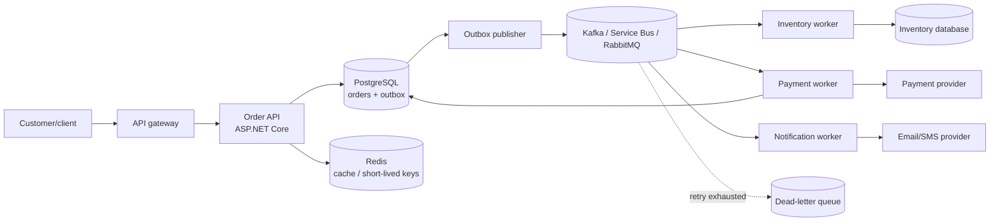
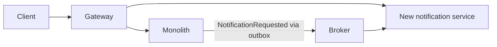

# .NET System Design Interview Answers: A Practical, Deep Guide

This is an interview-ready guide for a senior C#/.NET developer. It gives you a repeatable way to answer system-design questions, then applies it to a high-volume order-processing system. The final sections show how to adapt the approach to URL shorteners and notification platforms.

The goal is **not** to recite technology names. A strong answer makes assumptions explicit, protects critical business operations, explains trade-offs, and anticipates failure.

---

## 1. A repeatable 45-minute interview structure

When asked to design a system, use this sequence. It prevents you from jumping immediately into microservices, databases, or diagrams.

| Time | What to do | What to say |
| --- | --- | --- |
| 0–5 min | Clarify scope | “Before designing, I’d like to confirm the main user journey, scale, latency, and which operations require strict correctness.” |
| 5–10 min | State requirements and estimates | “I will optimize for accepting orders reliably; fulfillment can be asynchronous.” |
| 10–15 min | Draw the high-level architecture | Start with client, API, database, broker, workers, and external dependencies. |
| 15–25 min | Go deep on data and APIs | Explain schema, indexes, API behavior, caching, and consistency. |
| 25–35 min | Explain failures | Cover duplicate requests/messages, retries, broker outage, provider timeout, poison messages, and backpressure. |
| 35–45 min | Operations and trade-offs | Cover horizontal scale, observability, rollout, DR, security, and alternatives. |

### Useful opening questions

Ask only the questions that change the design:

1. What are the core user actions and what is out of scope?
2. What is the expected average and peak traffic? Read-heavy or write-heavy?
3. Which action must be strongly consistent? For example: “must a customer never be charged twice?”
4. What latency is expected for the initial response?
5. Is multi-region availability required? What are the RPO and RTO targets?
6. Are there compliance requirements such as PCI, GDPR, or audit history?

If the interviewer has no answers, state reasonable assumptions and proceed. For example: “I’ll assume 10 million events per day, 20× traffic spikes, a p99 API target below 300 ms, and that payment correctness is stricter than real-time order-status visibility.”

---

# 2. Worked example: high-volume order-processing system

## 2.1 The prompt

> Design an order-processing platform using .NET. It accepts customer orders, reserves stock, charges payment, and sends confirmation. It needs to process 10 million events per day.

## 2.2 A concise answer you can say first

> I would make order acceptance synchronous and all slow, failure-prone work asynchronous. The Order API validates the request and writes both the order and an outbox event to a transactional SQL database. A publisher sends durable outbox events to a broker. Separate inventory, payment, and notification workers consume those events. I’d use idempotency keys at the API, a unique payment record per order, and the payment provider’s own idempotency key so at-least-once delivery cannot charge the customer twice. The services would be stateless and horizontally scaled, with Redis only for cache or short-lived coordination—not the source of truth for an order or payment.

Then draw and explain the following design.



## 2.3 Functional and non-functional requirements

### Functional requirements

- Customer creates an order containing items and a payment method reference.
- Customer can retrieve the order status.
- Inventory is reserved or declined.
- A payment is charged only once.
- The customer receives a confirmation or failure notification.
- Operations staff can inspect and safely replay failed asynchronous work.

### Non-functional requirements

| Concern | Design decision |
| --- | --- |
| Correctness | Strong consistency for a recorded order and payment idempotency; eventual consistency between order, stock, and notification status. |
| Availability | Accept orders while notification systems are down; queue work for later. |
| Performance | Return after durable acceptance, rather than waiting on payment/email providers. |
| Scale | Stateless APIs/workers; partitioned broker; autoscaling based on lag. |
| Security | Tokenize payment methods, use TLS, least privilege, authorization, audit records, encrypted secrets. |
| Operability | Correlation IDs, traces, SLOs, queue-lag dashboards, alerting, DLQ procedures. |

## 2.4 Capacity estimate: how to discuss 10 million events/day

10,000,000 ÷ 86,400 is approximately **116 events/second on average**. Traffic is rarely flat. If a campaign or peak hour produces 20× load, plan initially for around **2,300 events/second**.

Be careful: an order may create several events (`OrderSubmitted`, `InventoryReserved`, `PaymentSucceeded`, `OrderCompleted`, `NotificationRequested`). So 10 million “events” is not necessarily 10 million customer orders. In an interview, explicitly ask which one it means, then size your broker and worker groups around the actual event count.

You do not need to invent exact pod counts. Say:

> I would choose the number of partitions and consumers from a load test. I need enough partitions to permit parallel consumer work while keeping events for one order ordered. I’d scale workers from queue depth, oldest-message age, CPU, and payment-provider rate limits.

## 2.5 API design

```http
POST /v1/orders
Authorization: Bearer <token>
Idempotency-Key: 0e2a2bdf-...
Content-Type: application/json

{
  "items": [
    { "sku": "keyboard-42", "quantity": 1 }
  ],
  "paymentMethodId": "pm_tokenized_value"
}

202 Accepted
Location: /v1/orders/8bcf...
{
  "orderId": "8bcf...",
  "status": "Pending"
}
```

Why `202 Accepted`? The platform has durably accepted the request, but payment and inventory are still being processed. Returning `200 Paid` at this point would misrepresent the state.

```http
GET /v1/orders/8bcf...

200 OK
{
  "orderId": "8bcf...",
  "status": "Confirmed",
  "total": { "amount": 149.99, "currency": "USD" }
}
```

The caller’s identity is taken from the access token—not a client-provided customer ID—and the API authorizes that the caller owns the order.

## 2.6 Data model and SQL versus NoSQL

The order ledger benefits from an ACID relational database:

```sql
create table orders (
    id uuid primary key,
    customer_id uuid not null,
    idempotency_key varchar(128) not null unique,
    status varchar(32) not null,
    total_amount numeric(18, 2) not null,
    currency char(3) not null,
    payment_method_id varchar(128) not null,
    created_at timestamptz not null default now(),
    version bigint not null default 0
);

create table payments (
    id uuid primary key,
    order_id uuid not null unique references orders(id),
    provider_charge_id varchar(128) unique,
    status varchar(32) not null,
    amount numeric(18, 2) not null,
    updated_at timestamptz not null
);

create table outbox_messages (
    id uuid primary key,
    aggregate_id uuid not null,
    type varchar(200) not null,
    payload jsonb not null,
    occurred_at timestamptz not null,
    published_at timestamptz null,
    lease_until timestamptz null,
    attempts integer not null default 0
);

create index ix_outbox_ready on outbox_messages(occurred_at)
    where published_at is null;
```

### Trade-off answer

> I’d choose PostgreSQL/SQL Server for orders and payments because I need transactions, uniqueness constraints, auditability, and predictable relational queries. A NoSQL store can be a good fit for massive key-value access, flexible metadata, click analytics, or an event projection, but I would not use it as the only correctness boundary for payment state without carefully establishing equivalent conditional-write guarantees. I may use both: SQL as source of truth and a denormalized read model for specific scale needs.

## 2.7 Idempotent API implementation in ASP.NET Core

An idempotency key makes a client retry safe. The decisive protection belongs in the database unique constraint—Redis can reduce repeated work but cannot be the only protection because its keys expire or it can fail over.

```csharp
public sealed record CreateOrderRequest(
    IReadOnlyList<OrderItemRequest> Items,
    string PaymentMethodId);

public sealed record OrderItemRequest(string Sku, int Quantity);

app.MapPost("/v1/orders", async (
    CreateOrderRequest request,
    ClaimsPrincipal user,
    [FromHeader(Name = "Idempotency-Key")] string? idempotencyKey,
    OrdersDbContext db,
    CancellationToken ct) =>
{
    if (string.IsNullOrWhiteSpace(idempotencyKey))
        return Results.BadRequest(new { error = "Idempotency-Key is required." });

    var customerId = Guid.Parse(user.FindFirstValue("sub")!);
    var existing = await db.Orders
        .SingleOrDefaultAsync(o => o.IdempotencyKey == idempotencyKey, ct);

    if (existing is not null)
        return Results.Accepted($"/v1/orders/{existing.Id}", new { orderId = existing.Id, existing.Status });

    var order = Order.Create(customerId, request.Items, request.PaymentMethodId, idempotencyKey);
    db.Orders.Add(order);
    db.OutboxMessages.Add(OutboxMessage.Create(
        type: "orders.submitted.v1",
        aggregateId: order.Id,
        payload: new OrderSubmitted(order.Id)));

    try
    {
        // Order and outbox record commit atomically in one DB transaction.
        await db.SaveChangesAsync(ct);
    }
    catch (DbUpdateException exception) when (IsUniqueKeyViolation(exception))
    {
        // A concurrent retry won. Return its durable result.
        var winner = await db.Orders.SingleAsync(o => o.IdempotencyKey == idempotencyKey, ct);
        return Results.Accepted($"/v1/orders/{winner.Id}", new { orderId = winner.Id, winner.Status });
    }

    return Results.Accepted($"/v1/orders/{order.Id}", new { orderId = order.Id, order.Status });
});
```

**Important interview detail:** bind the idempotency key to the customer identity and ideally hash the normalized request body too. If the same key is reused with a different payload, return `409 Conflict` rather than treating it as the original request.

## 2.8 Why the transactional outbox is necessary

This broken approach is common:

```csharp
await db.SaveChangesAsync(ct);           // Order is stored.
await broker.PublishAsync(orderEvent);   // Process crashes here: event never arrives.
```

The outbox stores the event beside the order in the same transaction. A separate process publishes it. It may publish a message twice after a crash, so consumers must be idempotent; but it will not silently lose a committed order event.

```csharp
public sealed class OutboxPublisher(
    IServiceScopeFactory scopes,
    IMessageBus bus,
    ILogger<OutboxPublisher> logger) : BackgroundService
{
    protected override async Task ExecuteAsync(CancellationToken stoppingToken)
    {
        while (!stoppingToken.IsCancellationRequested)
        {
            using var scope = scopes.CreateScope();
            var db = scope.ServiceProvider.GetRequiredService<OrdersDbContext>();

            // Production version: atomically lease rows using SKIP LOCKED or equivalent.
            var batch = await db.OutboxMessages
                .Where(x => x.PublishedAt == null &&
                            (x.LeaseUntil == null || x.LeaseUntil < DateTimeOffset.UtcNow))
                .OrderBy(x => x.OccurredAt)
                .Take(100)
                .ToListAsync(stoppingToken);

            foreach (var message in batch)
            {
                try
                {
                    await bus.PublishAsync(
                        topic: message.Type,
                        messageId: message.Id.ToString(),
                        body: message.Payload,
                        cancellationToken: stoppingToken);
                    message.PublishedAt = DateTimeOffset.UtcNow;
                }
                catch (Exception ex) when (IsTransient(ex))
                {
                    message.Attempts++;
                    logger.LogWarning(ex, "Outbox publish failed for {MessageId}", message.Id);
                }
            }
            await db.SaveChangesAsync(stoppingToken);
            await Task.Delay(batch.Count == 0 ? TimeSpan.FromSeconds(1) : TimeSpan.Zero, stoppingToken);
        }
    }
}
```

For large systems, Debezium/change-data-capture can publish committed outbox changes to Kafka. For Azure, a polling publisher or a supported transactional integration may be used. The invariant matters more than the tool: **a committed business change must eventually produce its event.**

## 2.9 Preventing duplicate payment charges

This is a critical deep-dive question. Answer in layers:

1. API idempotency key protects duplicate HTTP requests.
2. A database `UNIQUE(order_id)` constraint permits one payment record per order.
3. The worker calls the payment provider with a stable provider idempotency key such as `charge:{orderId}`.
4. The payment state is persisted before/after calls and reconciled if the provider result is uncertain.
5. The payment provider’s webhook is also idempotent and reconciles against the stored provider charge ID.

```csharp
public sealed class PaymentHandler(PaymentsDbContext db, IPaymentProvider provider)
{
    public async Task HandleAsync(OrderSubmitted message, CancellationToken ct)
    {
        var payment = await db.Payments.SingleOrDefaultAsync(x => x.OrderId == message.OrderId, ct);
        if (payment?.Status == PaymentStatus.Succeeded) return; // repeat broker delivery

        if (payment is null)
        {
            payment = Payment.CreatePending(message.OrderId, message.Amount, message.Currency);
            db.Payments.Add(payment);
            await db.SaveChangesAsync(ct); // unique order_id is the concurrency guard
        }

        // If this call times out, we do NOT generate a new key and charge again.
        // We retry/query the provider using the same stable key.
        var result = await provider.ChargeAsync(
            amount: payment.Amount,
            currency: payment.Currency,
            idempotencyKey: $"charge:{payment.OrderId}",
            cancellationToken: ct);

        payment.ApplyProviderResult(result);
        await db.SaveChangesAsync(ct);
    }
}
```

There is no magical exactly-once distributed transaction across your database, broker, and a payment provider. The correct design combines durable state, unique constraints, stable idempotency keys, and reconciliation.

## 2.10 Inventory and sagas

Payment and inventory are separate resources. A cross-service database transaction is brittle, so use a **saga**: a sequence of local transactions with compensating actions.

Example:

1. `OrderSubmitted` → reserve inventory.
2. If successful → charge payment.
3. If payment fails → release inventory.
4. If payment succeeds → mark order confirmed and request notification.

For an interview, call out the business choice: reserving stock first reduces payment refunds; charging first may improve inventory availability in some models. The product team decides the policy, and the system models compensations explicitly.

## 2.11 Retry policy, dead-letter queue, and poison messages

Not every error deserves a retry.

| Failure | Action |
| --- | --- |
| HTTP timeout, temporary DNS issue, 429, 503 | Retry with exponential backoff and jitter; respect `Retry-After`. |
| Invalid event schema, missing required field | Do not retry; send to DLQ and alert owner. |
| Card declined | Business failure; update order/payment state, do not retry automatically. |
| Repeated provider outage | Bounded retries, circuit breaker, delayed retry, alert. |

```csharp
// Example policy concept; configure exact limits per dependency and provider SLA.
var retry = Policy
    .Handle<HttpRequestException>()
    .Or<TaskCanceledException>()
    .WaitAndRetryAsync(5,
        attempt => TimeSpan.FromMilliseconds(200 * Math.Pow(2, attempt))
                   + TimeSpan.FromMilliseconds(Random.Shared.Next(0, 250)));
```

A DLQ is not a trash can. Store message ID, schema version, error, attempt count, timestamps, and correlation ID. Create a runbook: triage, fix the code/data, replay safely, and measure DLQ age/count. Alert on DLQ growth and on the age of the oldest message.

## 2.12 What if the broker is unavailable?

**Best answer:**

> If the broker is unavailable but SQL is healthy, the Order API continues to commit orders plus outbox events. Customers see `Pending`; the outbox publisher retries after recovery. We alert on unpublished outbox age and storage growth. If the broker outage lasts long enough to threaten database capacity or our order-completion SLO, we apply backpressure and return a retryable error. We do not claim an order is paid merely because it was accepted.

This is why the outbox is useful: it separates durable acceptance from broker availability. Be clear that accepting unlimited work during a multi-day outage is not free—the outbox needs capacity limits and an operational response.

## 2.13 Redis: useful, but not magic

Good uses:

- Cache product/catalog reads with cache-aside and TTL.
- Cache highly read order projections only if staleness is acceptable.
- Store short-lived rate-limit counters.
- Distributed locks only when there is a clear lease/expiry strategy; do not rely on them for money correctness.

Avoid treating Redis as the authoritative order/payment ledger. On cache miss or failure, fall back to the database. Use TTL jitter to avoid many keys expiring simultaneously (cache stampede); consider request coalescing for especially hot keys.

## 2.14 Scaling ASP.NET Core and workers

- Keep services stateless. Session data should not require a request to reach the same pod.
- Run multiple API replicas behind a load balancer; use readiness checks so an unready pod receives no traffic.
- Limit worker concurrency with `SemaphoreSlim` or broker-client configuration, especially for a rate-limited payment provider.
- Partition events by `orderId` when per-order ordering is important.
- Autoscale on oldest queue-message age, queue depth, consumer lag, CPU, and downstream capacity.
- Make database pools finite and tune connection limits; uncontrolled parallelism can exhaust the database before CPU rises.

```csharp
// Bounded concurrency, unlike creating unbounded tasks for every message.
using var gate = new SemaphoreSlim(initialCount: 50);
var tasks = messages.Select(async message =>
{
    await gate.WaitAsync(ct);
    try { await handler.HandleAsync(message, ct); }
    finally { gate.Release(); }
});
await Task.WhenAll(tasks);
```

In a real consumer, prefer the broker SDK’s bounded, long-running receive loop instead of loading an unbounded message list into memory.

## 2.15 Observability: how to answer beyond “use logs”

Use OpenTelemetry with structured logs, metrics, and distributed traces. Propagate W3C trace context through HTTP and messages. Every relevant log/event includes `traceId`, `orderId`, `messageId`, and a safe tenant/customer identifier.

| Signal | Example question it answers |
| --- | --- |
| API p95/p99 latency and error rate | Are customers experiencing failure? |
| Queue depth and oldest-message age | Are we keeping up with work? |
| Retry and DLQ rate | Is a dependency or a release failing? |
| Payment success rate / duplicate attempts | Is the business workflow correct? |
| DB connection pool usage / slow query count | Is data access the bottleneck? |
| SLO/error-budget burn | Should we pause releases and restore reliability? |

Alert on symptoms and customer impact: sustained p99 breach, high error-budget burn, oldest-message age, and payment-failure anomalies. A CPU alert alone is often noisy and late.

## 2.16 Deployment, rollback, migrations, and DR

### Safe database migration pattern

Use **expand → migrate code → contract**:

1. Add nullable columns/new tables/indexes; do not remove or rename a live dependency.
2. Deploy code that can read both old and new shapes and writes the new shape.
3. Backfill slowly and verify.
4. Switch reads using a feature flag after metrics confirm correctness.
5. Remove old fields only after all old application versions and consumers are gone.

For application releases, use canary or blue/green deployment, health checks, feature flags, and an automated rollback based on error rates/latency. A database rollback often means a forward corrective migration rather than restoring a schema blindly.

For disaster recovery, specify a multi-AZ database, encrypted backups, point-in-time recovery, tested restores, a documented RPO (acceptable data loss) and RTO (acceptable recovery time), plus periodic game days. “We have backups” is not enough; a restore must be tested.

---

# 3. Evolving a monolith into services

## What to say

> I would not begin with a big-bang rewrite. First I’d make the monolith modular, identify bounded contexts and data ownership, and extract one low-risk capability through a strangler migration. The new service owns its data, exposes a versioned contract, and receives domain events through an outbox. I would only continue extracting where independent deployment, scaling, team ownership, or fault isolation produces more value than distributed-system complexity.

## Step-by-step approach

1. Map the current monolith: modules, calls, tables, deployment bottlenecks, error hotspots, and ownership.
2. Define business boundaries: Identity, Catalog, Orders, Payments, and Notifications are more meaningful than “frontend/backend/database.”
3. Introduce clean module interfaces within the monolith first. This is a useful destination even if nothing is extracted.
4. Extract a low-coupled capability—often notifications, search, reporting, or media processing.
5. Use the strangler pattern. Route a small percentage of traffic to the new service, compare outcomes, then gradually cut over.
6. Move data ownership, not merely code. Do not leave two services writing the same tables.
7. Invest in platform maturity: deployment automation, service identity, contract tests, tracing, dashboards, incident ownership.



## When not to use microservices

Stay with a modular monolith if the team is small, the product is rapidly evolving, modules need frequent cross-boundary database transactions, deployments are not a bottleneck, or there is insufficient operational maturity. Microservices create network failures, eventual consistency, duplicated operational work, versioning needs, and much more difficult debugging. They are a means to independent ownership and deployment—not a default sign of maturity.

---

# 4. How to adapt the framework to other common prompts

## 4.1 URL shortening service

### Requirements to clarify

- Create custom or generated short links; redirect a short code to a long URL.
- Read/write ratio? Most systems are redirect-heavy.
- Expiration, click analytics, custom aliases, abuse protection, and regional latency.

### Design

`POST /links` writes `{shortCode, longUrl, ownerId, expiration}`. `GET /{shortCode}` performs a redirect. Use a globally unique generated ID encoded in Base62, or a collision-checked random code. Cache hot code-to-URL mappings in Redis. A key-value/noSQL store can work well for direct lookup at high scale; SQL is also suitable at moderate scale and better for reporting/transactions.

Click analytics goes asynchronously to a broker so redirect latency is not tied to analytics availability.

```csharp
app.MapGet("/{code}", async (string code, ILinkCache cache, LinksDbContext db, CancellationToken ct) =>
{
    var url = await cache.GetAsync(code, ct);
    if (url is null)
    {
        url = await db.Links.Where(x => x.Code == code && x.ExpiresAt > DateTimeOffset.UtcNow)
            .Select(x => x.LongUrl).SingleOrDefaultAsync(ct);
        if (url is null) return Results.NotFound();
        await cache.SetAsync(code, url, TimeSpan.FromHours(1), ct);
    }
    // Analytics is published asynchronously / best effort.
    return Results.Redirect(url, permanent: false);
});
```

Mention open-redirect abuse, malicious URLs, rate limiting, link scanning, custom-alias uniqueness, cache stampede prevention, and 301 vs 302 semantics. Never make analytics writes part of the redirect’s critical latency path.

## 4.2 Notification platform

### Requirements to clarify

- Which channels: email, SMS, push, in-app? Bulk campaigns or transactional messages?
- Delivery SLA, user preferences, templates/locales, provider limits, deduplication, and unsubscribe/compliance requirements?

### Design

Expose a `POST /notifications` API that validates a request and writes a notification job/outbox. A dispatcher selects a channel based on policy and user preferences. Channel workers use provider adapters, per-provider rate limits, retry policies, delivery webhooks, and a DLQ. The notification database tracks requested, accepted, sent, delivered, failed, and suppressed states.

Key insight: “sent to provider” is different from “delivered to recipient.” Webhooks update final delivery state and must be signature-verified and idempotent.

---

# 5. Common interviewer follow-ups and good responses

| Question | High-quality response |
| --- | --- |
| “Why not just use a distributed transaction?” | “It is usually unavailable or too fragile across a database, broker, and payment provider. I use local ACID transactions plus an outbox, idempotent consumers, and compensation/reconciliation.” |
| “How do you guarantee exactly once?” | “Transport exactly-once is rarely realistic end-to-end. I guarantee effectively-once business effects using unique constraints, stable idempotency keys, and durable state.” |
| “Why Redis?” | “For latency and load reduction on safe cacheable reads. It is not my source of truth for payments or orders.” |
| “What if Redis is down?” | “The system remains correct by falling back to the database, with capacity controls. Latency/load may worsen, so I monitor it and avoid making correctness depend on it.” |
| “How would you test this?” | “Unit-test state transitions and idempotency; integration-test database constraints and outbox behavior; contract-test provider/broker schemas; load-test peak traffic; and run failure tests for timeouts, duplicate delivery, restart, and broker outages.” |
| “What is the most important trade-off?” | “Fast response and availability versus immediate global consistency. I acknowledge an order only after durable acceptance and expose a pending state; payment and notification complete asynchronously.” |

---

# 6. Final checklist for your interview answer

Before finishing, make sure you have said something about:

- Requirements, scale estimate, and the critical consistency invariant.
- API contract and data model/indexes.
- Why SQL, NoSQL, Redis, and a queue are—or are not—needed.
- Synchronous path versus asynchronous path.
- Idempotency for both HTTP requests and broker messages.
- Retries, DLQ, timeouts, backpressure, and dependency outages.
- Horizontal scaling and bounded concurrency.
- Logs, metrics, traces, SLOs, alerts, security, deployment, migrations, and DR.
- At least one meaningful trade-off and one reason to choose a simpler design.

If you present the design in this order, you will sound structured and practical even if the interviewer changes the product domain midway through the discussion.
