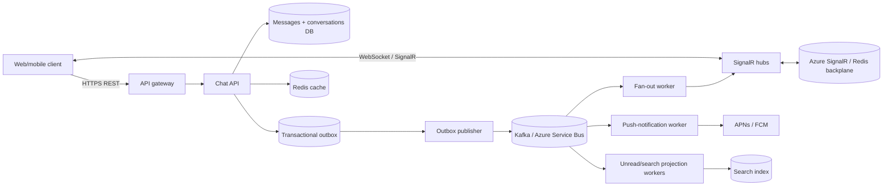

# System Design Case Study: Real-Time Chat Platform in .NET

## Interview prompt

> Design a real-time chat platform similar to Slack, Microsoft Teams, or direct messaging in a social app. Users can send one-to-one and group messages, see recent history, receive messages while online, and receive push notifications while offline. Use .NET for the backend.

This is an excellent senior-level prompt because it tests API design, WebSockets, persistence, ordering, fan-out, horizontal scaling, offline delivery, security, and operational judgment.

---

# 1. How to start the interview

Do not begin with SignalR or Kafka. Start with scope.

## 1.1 Clarifying questions to ask

1. Is this one-to-one chat, groups, channels, or all three?
2. Do we need message editing, deletion, reactions, typing indicators, read receipts, attachments, and search now?
3. How many daily active users, concurrent connections, messages/day, largest group size, and peak messages/second?
4. What delivery guarantee is expected: at-most-once, at-least-once, or visible deduplication?
5. Is per-conversation message order required? Is a global order required?
6. What is the acceptable latency for an online recipient?
7. Is multi-region active-active required? What data-residency/security requirements exist?
8. Are push notifications required when recipients are offline?

## 1.2 Reasonable assumptions if the interviewer does not provide them

| Category | Assumption |
| --- | --- |
| Users | 10 million registered, 1 million daily active, 100,000 concurrent connections at peak. |
| Traffic | 50 million messages/day: ~580 messages/sec average; design for 10× peak ≈ 6,000 messages/sec. |
| Conversations | Direct messages and groups up to 1,000 members. Very large broadcast channels are explicitly a separate path. |
| Latency | Online message delivery p99 under 500 ms in a region. |
| Correctness | Preserve order within one conversation; tolerate eventual consistency for unread counters/search. |
| Availability | A user can send while a notification provider is down; messages remain durable. |
| Security | Strong authentication, membership authorization, TLS, encrypted storage, audit/support controls. |

### Opening answer you can say aloud

> I’ll optimize for durable message acceptance and low-latency online delivery. The client will use REST for history and commands plus SignalR/WebSockets for live events. A message write is stored durably before it is acknowledged. Events are then placed on a broker partitioned by conversation ID, allowing ordered per-conversation processing and scalable fan-out. SignalR nodes remain stateless and use a managed backplane or Redis backplane for connection routing. Offline push, search indexing, and unread counters are asynchronous projections, so those dependencies do not block message acceptance.

---

# 2. Requirements and key trade-offs

## 2.1 Functional requirements

- Create a direct or group conversation.
- Send a text message to a conversation.
- Receive online messages in real time.
- Retrieve paginated message history.
- Show delivery/read state at a practical level.
- Notify offline users through push notification.
- Enforce that only conversation members can view/send messages.

## 2.2 Out of scope for the first version

- End-to-end encryption (E2EE) changes search, moderation, key management, and multi-device design substantially; discuss it as an extension.
- Large file handling; use object storage with pre-signed upload URLs as a later addition.
- Full-text search, which should be an asynchronous indexed projection.
- Massive broadcast channels with millions of subscribers; treat them differently from ordinary groups.

## 2.3 Important trade-offs

| Requirement | Design choice | Why |
| --- | --- | --- |
| Durable send | Database write before acknowledgement | Acknowledge only work that survives API/node failure. |
| Per-chat order | Partition by `conversationId` | Parallel conversations scale; each conversation has a stable order. |
| Real-time UX | SignalR/WebSocket | Server can push without polling. |
| Offline reliability | Durable event + push worker | Push provider outage does not lose the message. |
| Scalability | Stateless API/hub nodes + broker | Connections and workers scale independently. |
| Read performance | Separate history store/read model + cache | History reads should not overload write path. |

---

# 3. High-level architecture



### Components explained

- **Chat API:** validates sender/membership, assigns durable message identity/order, stores messages, writes outbox events.
- **Messages database:** source of truth for conversations and messages. A relational database works well for membership constraints and normal group sizes; high-scale message history may use a partitioned wide-column/key-value store.
- **Transactional outbox:** guarantees a committed message has a durable event to publish.
- **Broker:** decouples sending from fan-out, notifications, and projections. Partitioned by conversation preserves its order.
- **Fan-out worker:** routes the event to online members via SignalR. It does not determine durable history.
- **SignalR / backplane:** hosts live connections. A managed SignalR service simplifies multi-node connection management; Redis backplane is an alternative with operating responsibility.
- **Redis:** caches conversation membership/read state or recent history only where stale data is acceptable. It is not the authority for a message.

---

# 4. API and message contracts

## 4.1 HTTP APIs

```http
POST /v1/conversations
{
  "memberIds": ["user-b"],
  "type": "direct"
}

POST /v1/conversations/{conversationId}/messages
Idempotency-Key: 3c2c6...
{
  "clientMessageId": "a7e9...",
  "text": "Hello"
}

201 Created
{
  "messageId": "msg_...",
  "sequence": 481,
  "sentAt": "2026-07-13T10:00:00Z"
}

GET /v1/conversations/{conversationId}/messages?beforeSequence=481&limit=50
```

The **server** controls `senderId`, timestamp, membership, content policy, and sequence. The client-provided ID helps client-side deduplication, but it is never trusted as authorization or ordering evidence.

## 4.2 Live SignalR event

```json
{
  "eventType": "message.created.v1",
  "messageId": "msg_...",
  "conversationId": "conv_...",
  "sequence": 481,
  "senderId": "user-a",
  "text": "Hello",
  "sentAt": "2026-07-13T10:00:00Z"
}
```

Include a schema version. Clients should ignore unknown fields, which allows compatible evolution. A reconnecting client treats SignalR as a low-latency hint; REST history/backfill is the source for any missed messages.

---

# 5. Data model and ordering

## 5.1 Relational schema

```sql
create table conversations (
    id uuid primary key,
    type varchar(16) not null, -- direct, group, channel
    created_by uuid not null,
    next_sequence bigint not null default 1,
    created_at timestamptz not null default now()
);

create table conversation_members (
    conversation_id uuid not null references conversations(id),
    user_id uuid not null,
    role varchar(32) not null default 'member',
    joined_at timestamptz not null default now(),
    last_read_sequence bigint not null default 0,
    primary key (conversation_id, user_id)
);
create index ix_conversation_members_user on conversation_members(user_id, conversation_id);

create table messages (
    id uuid primary key,
    conversation_id uuid not null references conversations(id),
    sequence bigint not null,
    sender_id uuid not null,
    client_message_id uuid not null,
    text text not null,
    sent_at timestamptz not null default now(),
    edited_at timestamptz null,
    deleted_at timestamptz null,
    unique (conversation_id, sequence),
    unique (conversation_id, sender_id, client_message_id)
);
create index ix_messages_history
    on messages(conversation_id, sequence desc);

create table outbox_messages (
    id uuid primary key,
    aggregate_id uuid not null,
    type varchar(100) not null,
    payload jsonb not null,
    occurred_at timestamptz not null,
    published_at timestamptz null
);
```

### Why a per-conversation sequence?

There is no practical need for a globally ordered sequence across every conversation. It would create a central bottleneck. A monotonic sequence **within a conversation** makes history pagination, client reordering, read receipts, and reconciliation straightforward.

One simple implementation locks the conversation row, increments `next_sequence`, and inserts the message in one short transaction. For high-throughput hot conversations, use a database sequence allocation/range mechanism or route that conversation to a single ordered partition/actor. A single celebrity channel is a special scaling problem and should not share the ordinary group-write design.

---

# 6. .NET implementation: authentication, hub authorization, and connection groups

## 6.1 SignalR configuration

```csharp
builder.Services.AddAuthentication().AddJwtBearer(options =>
{
    options.Authority = builder.Configuration["Auth:Authority"]!;
    options.Audience = "chat-api";
    options.Events = new JwtBearerEvents
    {
        OnMessageReceived = context =>
        {
            // Browsers commonly send access token in query string for WebSockets.
            // Accept it only for the hub path and ensure query strings are redacted in logs.
            var token = context.Request.Query["access_token"];
            if (!string.IsNullOrEmpty(token) && context.HttpContext.Request.Path.StartsWithSegments("/hubs/chat"))
                context.Token = token;
            return Task.CompletedTask;
        }
    };
});
builder.Services.AddAuthorization();
builder.Services.AddSignalR(); // Or AddAzureSignalR() for managed scale-out.

var app = builder.Build();
app.UseAuthentication();
app.UseAuthorization();
app.MapHub<ChatHub>("/hubs/chat").RequireAuthorization();
```

### Security note

The WebSocket handshake can require an access token in a query parameter in some browser/SignalR configurations. TLS is mandatory; configure access-log redaction so that token is never stored in request logs, monitoring URLs, or error reports.

## 6.2 Hub: joining only authorized conversation groups

Never let a client call `Groups.AddToGroupAsync` with any arbitrary conversation ID. Verify membership on the server.

```csharp
[Authorize]
public sealed class ChatHub(IConversationMembership membership) : Hub
{
    public override async Task OnConnectedAsync()
    {
        var userId = Context.UserIdentifier!;
        // Grouping by user permits fast delivery to every device owned by that user.
        await Groups.AddToGroupAsync(Context.ConnectionId, $"user:{userId}");
        await base.OnConnectedAsync();
    }

    public async Task SubscribeConversation(Guid conversationId)
    {
        var userId = Guid.Parse(Context.UserIdentifier!);
        if (!await membership.IsMemberAsync(userId, conversationId, Context.ConnectionAborted))
            throw new HubException("Not authorized for this conversation.");

        await Groups.AddToGroupAsync(Context.ConnectionId, $"conversation:{conversationId}");
    }
}
```

For a user with thousands of conversations, do not automatically add every connection to every conversation group. Fan-out to user groups after consulting membership, or subscribe only active/recent conversations; then use REST backfill on reconnect.

---

# 7. .NET implementation: durable, idempotent message send

## 7.1 Sending flow

1. API authenticates the caller.
2. Verify caller membership and message/content limits.
3. Verify idempotency key/client message ID.
4. In one database transaction: allocate the conversation sequence, insert message, insert outbox event.
5. Commit, return message ID and sequence.
6. An outbox publisher sends `message.created.v1` to the broker.
7. Fan-out worker emits a live SignalR event; other consumers update unread counts/search/push notifications.

```csharp
public sealed record SendMessageRequest(Guid ClientMessageId, string Text);

app.MapPost("/v1/conversations/{conversationId:guid}/messages", async (
    Guid conversationId,
    SendMessageRequest request,
    [FromHeader(Name = "Idempotency-Key")] string key,
    ClaimsPrincipal principal,
    ChatDbContext db,
    CancellationToken ct) =>
{
    if (string.IsNullOrWhiteSpace(key) || string.IsNullOrWhiteSpace(request.Text))
        return Results.BadRequest();
    if (request.Text.Length > 4_000)
        return Results.ValidationProblem(new Dictionary<string, string[]> { ["text"] = ["Maximum 4,000 characters."] });

    var userId = Guid.Parse(principal.FindFirstValue("sub")!);
    var isMember = await db.ConversationMembers
        .AnyAsync(m => m.ConversationId == conversationId && m.UserId == userId, ct);
    if (!isMember) return Results.Forbid();

    // Fast return for a network/client retry. Database unique keys still protect races.
    var existing = await db.Messages.SingleOrDefaultAsync(m =>
        m.ConversationId == conversationId && m.SenderId == userId &&
        m.ClientMessageId == request.ClientMessageId, ct);
    if (existing is not null)
        return Results.Ok(new { messageId = existing.Id, existing.Sequence, existing.SentAt });

    await using var tx = await db.Database.BeginTransactionAsync(ct);
    var conversation = await db.Conversations.SingleAsync(c => c.Id == conversationId, ct);
    var sequence = conversation.NextSequence++;
    var message = Message.Create(conversationId, sequence, userId, request.ClientMessageId, request.Text);
    db.Messages.Add(message);
    db.OutboxMessages.Add(OutboxMessage.From(new MessageCreated(message)));

    try
    {
        await db.SaveChangesAsync(ct);
        await tx.CommitAsync(ct);
    }
    catch (DbUpdateException ex) when (IsUniqueKeyViolation(ex))
    {
        // A concurrent retry created it. Query and return durable result.
        var winner = await db.Messages.SingleAsync(m =>
            m.ConversationId == conversationId && m.SenderId == userId &&
            m.ClientMessageId == request.ClientMessageId, ct);
        return Results.Ok(new { messageId = winner.Id, winner.Sequence, winner.SentAt });
    }

    return Results.Created($"/v1/conversations/{conversationId}/messages/{message.Id}",
        new { messageId = message.Id, message.Sequence, message.SentAt });
}).RequireAuthorization();
```

### Important improvement for production

The `SingleAsync` then increment sequence shown above is clear for explanation but needs deliberate concurrency control. Configure an optimistic concurrency token on `Conversation`, retry a serialization/concurrency failure, or issue an atomic SQL update such as `UPDATE conversations SET next_sequence = next_sequence + 1 ... RETURNING next_sequence - 1`. This avoids two parallel sends receiving the same sequence.

The idempotency key should also be persisted and tied to a hash of the request body. `clientMessageId` is useful because mobile clients can create it before going offline; still, only a server-side unique constraint is the final arbiter.

---

# 8. Fan-out and online delivery

## 8.1 Why not send directly from the API?

Calling a hub immediately after database save makes the live path fast, but it can lose a notification if the API node crashes after the database commit and before fan-out. It also couples message acceptance to hub availability. Use an outbox event for reliable fan-out; optionally perform a best-effort immediate send as an optimization, with consumer deduplication.

## 8.2 Fan-out consumer

```csharp
public sealed class MessageFanoutHandler(
    IHubContext<ChatHub> hub,
    IConversationMembership membership,
    IMessageDeliveryLedger deliveries)
{
    public async Task HandleAsync(MessageCreated evt, CancellationToken ct)
    {
        // Broker messages are at-least-once. Idempotent ledger stops repeat work.
        if (!await deliveries.TryBeginAsync(evt.MessageId, "realtime-fanout", ct))
            return;

        var memberIds = await membership.GetMemberIdsAsync(evt.ConversationId, ct);
        var payload = new
        {
            eventType = "message.created.v1",
            evt.MessageId,
            evt.ConversationId,
            evt.Sequence,
            evt.SenderId,
            evt.Text,
            evt.SentAt
        };

        // For normal groups. For huge groups, publish to sharded fan-out workers instead.
        foreach (var memberId in memberIds)
            await hub.Clients.Group($"user:{memberId}").SendAsync("MessageCreated", payload, ct);

        await deliveries.MarkCompleteAsync(evt.MessageId, "realtime-fanout", ct);
    }
}
```

SignalR delivery only confirms that a message was handed to the active connection infrastructure, not that a user saw it. A client acknowledges receipt/read separately; the client always has REST history recovery as its correctness mechanism.

## 8.3 Direct, group, and broadcast fan-out

| Conversation type | Fan-out strategy |
| --- | --- |
| Direct message | Emit to each participant’s user group; simple and inexpensive. |
| Small/normal group | Query/cache members and emit to user or conversation group. |
| Large group | Shard membership and fan-out across workers; do not create one synchronous loop in a request handler. |
| Millions of followers | Treat as a feed/broadcast system: async materialization, pull-based timeline, or dedicated pub/sub architecture. |

This distinction is a strong senior-level observation. A group chat of 20 members and a livestream chat of 2 million viewers are not the same problem.

---

# 9. Delivery receipts, read receipts, and offline clients

## 9.1 Define the terms

- **Accepted:** API committed the message.
- **Delivered:** platform delivered the event to an active device/session, if known.
- **Read:** client reports user has seen through a conversation sequence.

Do not claim “read” based merely on a socket send. Users may have multiple devices, no app foreground state, or an old client.

## 9.2 Efficient read state

For a conversation, store the highest sequence a member has read, not a row for every message receipt.

```http
POST /v1/conversations/{id}/read-state
{ "lastReadSequence": 481 }
```

```sql
update conversation_members
set last_read_sequence = greatest(last_read_sequence, @lastReadSequence)
where conversation_id = @conversationId and user_id = @userId;
```

The update is monotonic: a delayed mobile request cannot move a user’s read marker backwards. For very large groups, full per-user read receipts can be costly or undesirable; expose only aggregated/limited receipt state based on product requirements.

## 9.3 Reconnection and missed events

WebSocket connections are transient. On reconnect the client calls history with `afterSequence`/`beforeSequence` to reconcile, deduplicates by `messageId`, and orders by server sequence. This is why a persistent message store is the authority, not an in-memory SignalR connection.

---

# 10. Broker design, retries, duplicate events, and DLQ

## 10.1 Partitioning and ordering

Publish events with `conversationId` as the partition key. A partition provides order for that key and supports parallelism across many conversations. Do not promise global ordering across partitions.

If one conversation is extremely hot, it may occupy a partition; that is a product/architecture decision. Possible solutions are per-conversation actor/partition routing, or relaxing strict order for that special class of channel.

## 10.2 Delivery semantics

Most brokers are at-least-once. Consumers must be idempotent. Use event IDs and a durable consumer ledger/unique constraint.

```sql
create table processed_events (
    consumer_name varchar(100) not null,
    event_id uuid not null,
    processed_at timestamptz not null default now(),
    primary key (consumer_name, event_id)
);
```

The consumer inserts this record as part of its local transaction. If duplicate insertion fails, it has already processed the event. For side effects such as notification providers, use a stable external idempotency key as well.

## 10.3 Retry strategy

- Retry transient errors: network interruptions, `429`, temporary `5xx`, broker disconnects.
- Use bounded exponential backoff plus jitter; honor provider `Retry-After`.
- Do not retry invalid schema, forbidden action, malformed payload, or a permanent recipient failure.
- Send exhausted/poison messages to a DLQ with error details, trace ID, event version, and attempt count.
- Alert on DLQ growth and oldest-event age. Provide a controlled, idempotent replay tool.

### What if the broker is down?

The Chat API still commits the message and its outbox event if the database is healthy. The sender sees “sent” (durably accepted); recipients may not get real-time delivery until the publisher recovers. The UI can represent that distinction if desired. Monitor unpublished outbox age/size. If prolonged outage threatens storage capacity or message-delay SLOs, use backpressure and return a retryable failure rather than silently accepting unlimited work.

---

# 11. Database choice and scaling message history

## 11.1 SQL baseline

Use PostgreSQL/SQL Server initially when you need membership constraints, transactions, small-to-medium group chat, support queries, and familiar operations. Partition `messages` by date/hash when tables grow large; retain indexes that match history reads: `(conversation_id, sequence desc)`.

## 11.2 When a NoSQL/wide-column store is attractive

At very large history scale, access is naturally “messages for conversation X around sequence/time Y.” Cassandra/DynamoDB-style designs can distribute writes and reads by `conversationId` plus a time bucket. The cost is weaker ad-hoc querying, operational/modeling complexity, and careful handling for hot partitions.

### A good trade-off answer

> I would begin with a relational source of truth if expected scale and team capability permit it. I would shard/partition based on measured history growth and query pressure. If I move history to a wide-column store, I would model the primary access pattern explicitly and keep membership/authorization in a strongly consistent store. I would not introduce NoSQL simply because chat uses messages.

## 11.3 Cache strategy

Cache recent history or membership only when there is a demonstrated read bottleneck. Use cache-aside, TTL, and invalidation/versioning on membership changes. A membership cache must fail closed for authorization: if it is absent or uncertain, check the authoritative store rather than granting access.

---

# 12. Observability, security, and abuse prevention

## 12.1 Observability

Use structured logs and OpenTelemetry traces across REST, SignalR, broker messages, and workers. Include `traceId`, `conversationId`, `messageId`, event ID/version, and safe user identifiers.

| Metric | Why it matters |
| --- | --- |
| Send API p95/p99 and error rate | Sender experience and admission health. |
| Outbox unpublished age | Detects broker/publisher failure before data loss. |
| Broker consumer lag / oldest event age | Shows whether fan-out can keep up. |
| Active hub connections and reconnect rate | Connection scale and network/client instability. |
| Fan-out latency | Online recipient experience. |
| Push success/failure rate | Offline delivery health. |
| DLQ count and age | Unresolved permanent failures. |

Alert on SLO symptoms (latency, durable send failures, message lag) rather than only CPU. Build dashboards that let on-call trace a message from API acceptance to broker to fan-out/push.

## 12.2 Security and privacy

- Authenticate REST and WebSocket connections; revalidate/expire connections according to token policy.
- Authorize every conversation read/send/subscribe through membership checks.
- Enforce TLS, secret-vault storage, least-privilege database/service identities, and network segmentation.
- Sanitize/render user content safely to prevent XSS in clients; do not trust text merely because it is stored.
- Rate-limit message sends, joins, and connection attempts by user/device/IP; protect against spam and abuse.
- Encrypt data at rest and in transit; define retention/deletion policies and audit privileged support access.
- Avoid logging message content by default. Redact tokens, PII, and attachments.

### End-to-end encryption follow-up

If E2EE is required, clients encrypt message payloads and manage device keys; the server stores/routs ciphertext. This limits server-side search, moderation, and content-based notifications. Group membership/key rotation and multi-device synchronization become core cryptographic product work. Do not casually claim an existing server-side encryption design is E2EE.

---

# 13. Deployment, migrations, and disaster recovery

## Safe deployment

- Use rolling/canary deployment plus readiness probes; avoid dropping active hub connections unnecessarily.
- Make message/event schemas additive; version events and preserve old consumers during migration.
- Use feature flags for new client event behavior.
- Apply database changes with expand → backfill → switch reads → contract; do not drop a column while an older application version still uses it.
- Provide rollback. Usually roll application code back; schema rollback often requires a safe forward correction rather than destructive reversal.

## Disaster recovery

- Deploy databases/broker across availability zones; replicate according to chosen RPO/RTO.
- Test encrypted backups and point-in-time restore, not just backup creation.
- Preserve and replay outbox/broker events safely using idempotent consumer logic.
- Run game days: broker unavailability, one region loss, database failover, notification provider outage, and massive reconnect storms.

---

# 14. Likely interviewer follow-ups and strong answers

| Follow-up | Suggested response |
| --- | --- |
| “Why use REST and WebSockets?” | “WebSockets deliver live server events efficiently; REST provides durable commands/history and recovery after reconnect. The system is not correct merely because a socket is open.” |
| “How do you guarantee order?” | “I guarantee order per conversation using a server sequence and broker partition key. I do not claim global order, which would be expensive and unnecessary.” |
| “How do you avoid duplicate messages?” | “Client message ID/idempotency key, a database uniqueness constraint, outbox event IDs, idempotent consumer ledger, and client deduplication by server message ID.” |
| “What happens if the recipient is offline?” | “The message is already durable. The push worker may notify them, and on reconnect the client reads history from its last confirmed sequence.” |
| “What if SignalR is unavailable?” | “Message acceptance/history continue. Live delivery is delayed or unavailable until the hub recovers; clients reconnect and backfill. We monitor it separately from durable send.” |
| “How do you support a million-member channel?” | “I would not synchronously fan-out like group chat. It becomes a broadcast/feed architecture with sharded workers, pull/read models, and perhaps different ordering/receipt guarantees.” |
| “How do you remove a user from a group?” | “Update authoritative membership, invalidate cached membership, prevent future authorization, and remove active connections from conversation groups. Define explicitly whether history remains visible based on product policy.” |

---

# 15. Final interview summary

> The core design is a durable message store and transactional outbox, with REST as the correctness/recovery interface and SignalR as the low-latency online delivery interface. Events are partitioned by conversation ID for per-conversation ordering. Fan-out, push, search, and counters are asynchronous and idempotent. The design protects message durability even if a hub, broker, or notification provider fails, while allowing the API and workers to scale horizontally.

That summary demonstrates the essential senior-level themes: clear boundaries, correct delivery semantics, measured scalability, practical failure handling, and operational readiness.
